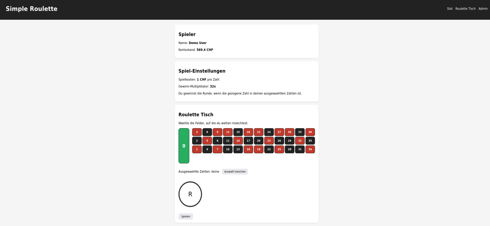
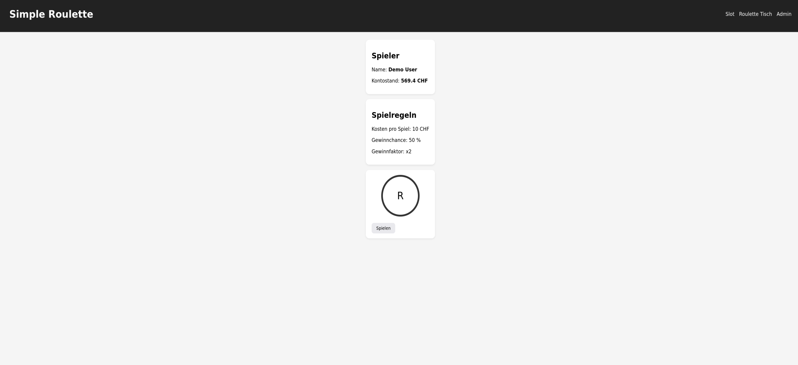
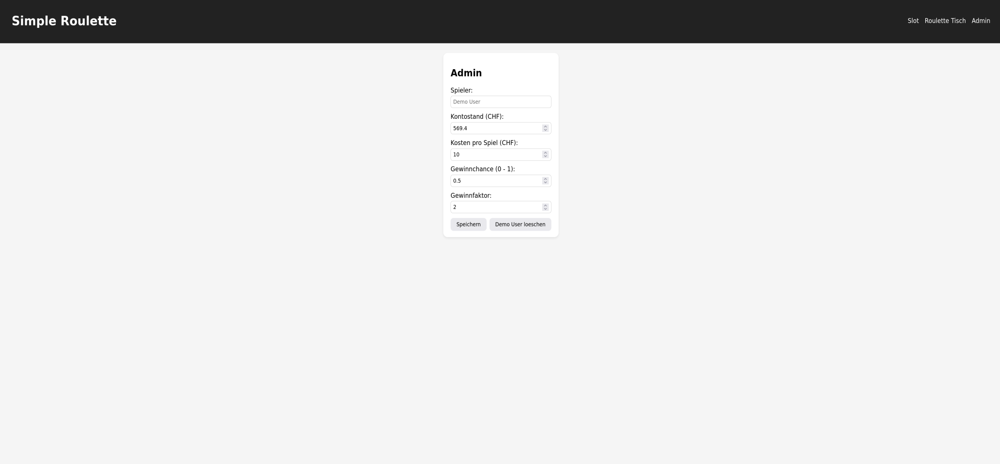

<div id="top">

<!-- HEADER STYLE: CLASSIC -->
<div align="center">


# WEBCASINO-PROJEKT-M294

<em>Aus Spiel werden unvergessliche Erlebnisse.</em>

<!-- BADGES -->


<em>Erstellt mit folgenden Werkzeugen und Technologien:</em>


</div>
<br>

---

## Inhaltsverzeichnis

- [Übersicht](#übersicht)
- [Demo und Screenshots](#demo-und-screenshots)
- [Erste Schritte](#erste-schritte)
  - [Voraussetzungen](#voraussetzungen)
  - [Installation](#installation)
  - [Nutzung](#nutzung)
  - [Testen](#testen)
- [Funktionen](#funktionen)
- [Projektstruktur](#projektstruktur)
---

## Übersicht

Dieses Projekt ist ein webbasiertes Casino-Interface, entwickelt als Projekt des Moduls M294.  
Es dient der Demonstration von React-Komponenten, Routing, Tests und modernen Frontend-Tools.

## Demo und Screenshots
### 🎰 Roulette Tisch



---

### 🎲 Slot-Spiel



---

### 🛠️ Admin Bereich



---

## Funktionen

|      | Komponente           | Details                                                                                     |
| :--- | :------------------- | :------------------------------------------------------------------------------------------ |
| ⚙️ | **Architektur** | <ul><li>Single-Page-Anwendung (SPA) mit React</li><li>Clientseitiges Routing über react-router-dom</li><li>Vite als Build-Tool für schnelle Entwicklung</li></ul> |
| 🔩 | **Codequalität** | <ul><li>Verwendet ESLint und Prettier für konsistenten Code</li><li>Modulare React-Komponenten</li><li>TypeScript wird nicht explizit verwendet; basiert auf JavaScript</li></ul> |
| 📄 | **Dokumentation** | <ul><li>Einfache README-Datei mit Projektübersicht</li><li>Inline-Codekommentare vorhanden</li><li>Begrenzte externe Dokumentation oder API-Dokumentation</li></ul> |
| 🔌 | **Integrationen** | <ul><li>React Router für die Navigation</li><li>Vite für Bundling und Entwicklungsserver</li><li>Testen mit Vitest und der React Testing Library</li><li>jsdom für die DOM-Testumgebung</li></ul> |
| 🧩 | **Modularität** | <ul><li>Komponentenbasierte React-Architektur</li><li>Trennung der Zuständigkeiten in Komponenten</li><li>Verwendung von npm-Skripten für Build/Test</li></ul> |
| 🧪 | **Testen** | <ul><li>Unit-Tests mit Vitest</li><li>Komponententests mit @testing-library/react</li><li>Simulierte Benutzerereignisse mit @testing-library/user-event</li></ul> |
| ⚡️ | **Performance** | <ul><li>Vite ermöglicht schnellen Hot Module Replacement</li><li>Code-Splitting durch dynamische Importe (implizit)</li></ul> |
| 🛡️ | **Sicherheit** | <ul><li>Grundlegende Sicherheitsmaßnahmen werden nicht detailliert beschrieben</li><li>Nur clientseitig; keine Backend-Sicherheitsfunktionen erkennbar</li></ul> |
| 📦 | **Abhängigkeiten** | <ul><li>Benötigt React, React DOM, react-router-dom</li><li>Build- und Test-Tools: vite, vitest, @testing-library/*</li><li>Paketabhängigkeiten werden über package.json verwaltet</li></ul> |


---

## Projektstruktur

```sh
└── WebCasino-Projekt-M294/
    ├── README.md
    ├── index.html
    ├── package-lock.json
    ├── package.json
    ├── src
    │   ├── App.jsx
    │   ├── api.js
    │   ├── components
    │   ├── index.css
    │   ├── main.jsx
    │   ├── pages
    │   └── styles.css
    ├── screenshots
    │   ├── admin-panel.png
    │   ├── roulette-table.png
    │   ├── slot-game.png
    └── vite.config.js
```

---

## Erste Schritte

### Voraussetzungen

Dieses Projekt benötigt folgende Abhängigkeiten:

- **Programmiersprache:** JavaScript
- **Paketmanager:** Npm

### Installation

WebCasino-Projekt-M294 aus dem Quellcode erstellen und Abhängigkeiten installieren:

1. **Repository klonen:**

```sh
❯ git clone https://github.com/FionnLaesser/WebCasino-Projekt-M294
```

2. **Zum Projektverzeichnis wechseln:**

```sh
❯ cd WebCasino-Projekt-M294
```

3. **Abhängigkeiten installieren:**

**Mit [npm](https://www.npmjs.com/):**

```sh
❯ npm install
```
### Nutzung

Starten Sie das Projekt mit:

**Mit [npm](https://www.npmjs.com/):**

```sh
npm run dev
```

### Testen

Webcasino-projekt-m294 verwendet Vitest als Testframework. Führen Sie die Testsuite mit folgendem Befehl aus:

**Mit [npm](https://www.npmjs.com/):**

```sh
npm test
```

---

<div align="left"><a href="#top">⬆ Zurück</a></div>

---
